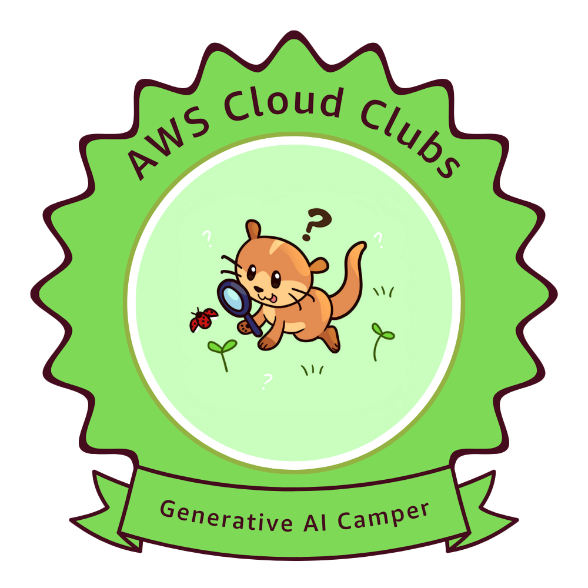

<h3 align="center">A passionate Computer Engineering student from Nepal 🇳🇵</h3>

---

### 🧑‍💻 About Me

- 🎓 I’m currently studying **Computer Engineering**  
- 💻 I love working on **tech projects** and improving my **coding skills**
- 🌱 I’m currently learning **Python, C++, and Web Development**
- 📫 How to reach me: **ayushrauniyarofficial@gmail.com**
- ⚡ Fun fact: I enjoy solving problems and exploring new technologies 🚀

---

### 🛠️ Tech Stack

#### Languages

#### Tools & Platforms

#### Frameworks

#### Concepts
`OOP`, `DSA`, `Web Development`, `Data Science`

---

### 🏆 AWS Cloud Clubs Generative AI Camper

<a href="https://www.credly.com/badges/ebfe8fe1-8901-4395-ae07-a5b8215d224c/public_url" target="_blank">View Badge</a>

> Earned by attending and completing the Generative AI Camp hosted by AWS Cloud Clubs.

---

<!--
---

### 📁 Projects

- 💡 [Simple Quiz Game (C++)](https://github.com/Ayush-r-018/quiz-game)  
- 🌐 [Portfolio Website](https://github.com/Ayush-r-018/portfolio-site)  
- 🧮 [Scientific Calculator in Python](https://github.com/Ayush-r-018/scientific-calculator)

---

### 🏆 AWS Certification

> Earned for completing the AWS Cloud Clubs Generative AI Camp.

---
-->

### 📈 GitHub Streak

---

### 📊 GitHub Stats

---

### 💻 Top Languages

---

### 🏆 GitHub Trophies

---

### 👀 Profile Views

